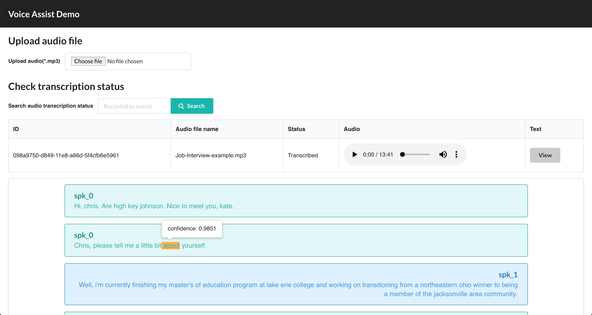
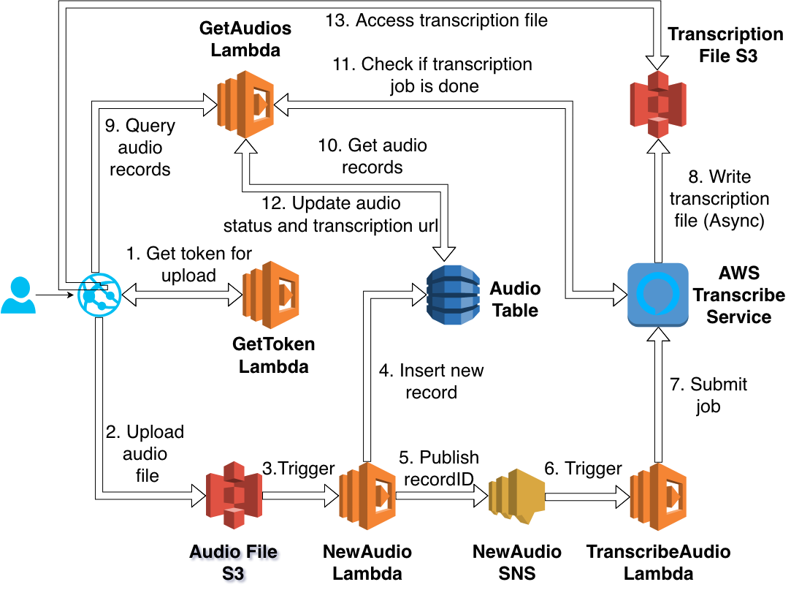

# AWS Transcribe demo

A simple AWS demo utilizes Amazon Transcribe to convert audio to text and do analyze.



## Deploy to your own AWS

- Setup AWS CLI and credential configuration (`aws configure`).
- Run `yarn` to install all dependencies.
- Run `yarn build` to build both front end and back end.
- Run `yarn bootstrap` to initialize AWS CDK deployment.
- Run `yarn deploy` to do the actual deployment.

If the deployment is successful, the cloudfront URL will be displayed in the output like:

```bash
Outputs:
AwsTranscribeDemoStack.CloudFrontURL = xxx.cloudfront.net
```

## Behind the scenes



- Static website built by React and hosted on S3.
- Upload audio file via website (click upload button):
  - Call `GetToken` Lambda function via API gateway to get pre-signed URL for Audio File bucket.
  - Use S3 JS SDK to upload audio file directly to S3 with the pre-signed URL returned above.
    - Newly uploaded audio file will trigger `NewAudio` Lambda function which will:
      - Create a record in DynamoDB
      - Publish the record ID to `NewAudio` Topic in SNS
      - SNS will trigger `TranscribeAudio` Lambda function to submit audio transcription job via Amazon Transcribe service API
- Check audio transcription status via website (click search button):
  - Call `GetAudios` Lambda function via API gateway to get transcription status
    - After getting record ID from DB, check the corresponding transcription job via Amazon Transcribe service API.
    - If the job is ready, update the result URL to DB and return it to frontend.
    - If the job is still processing, do nothing.
